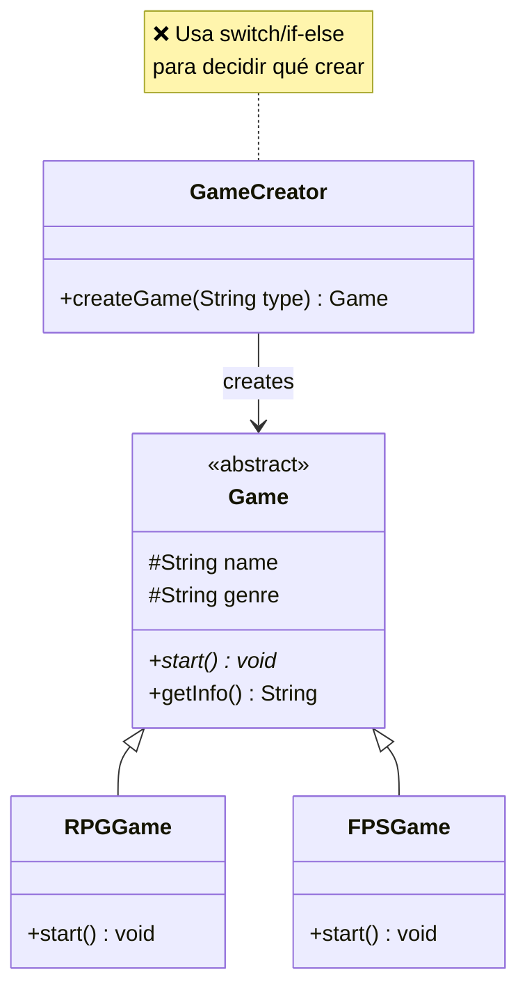
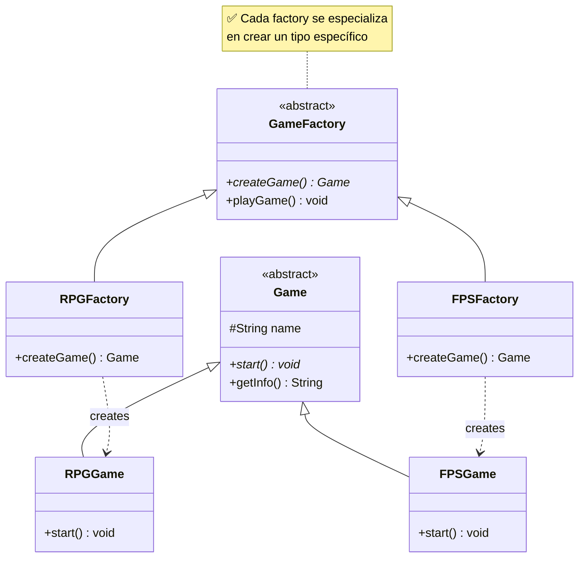
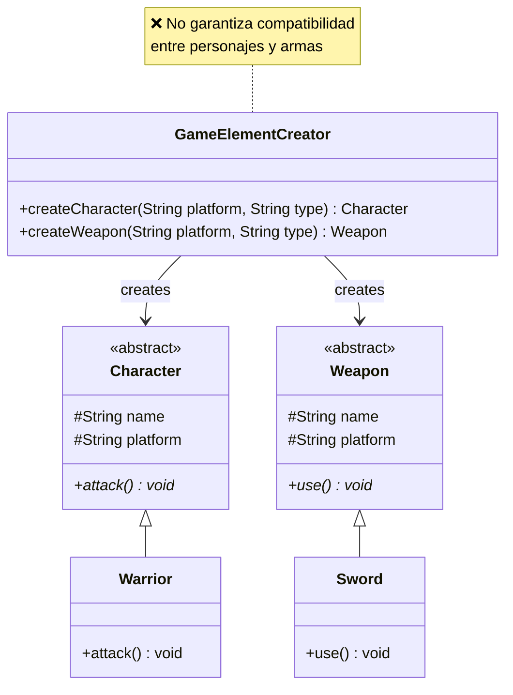
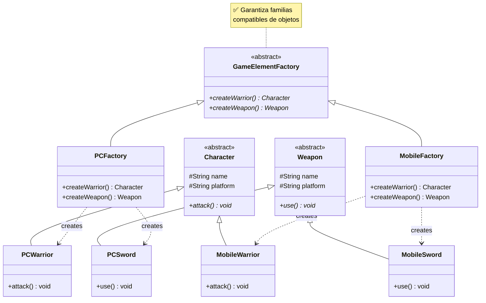
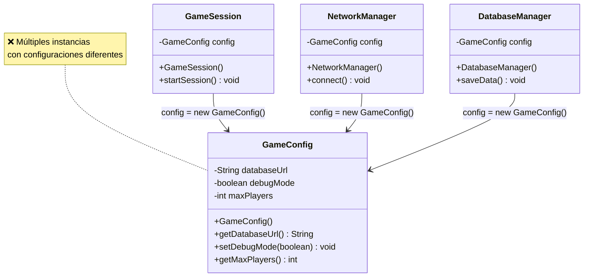
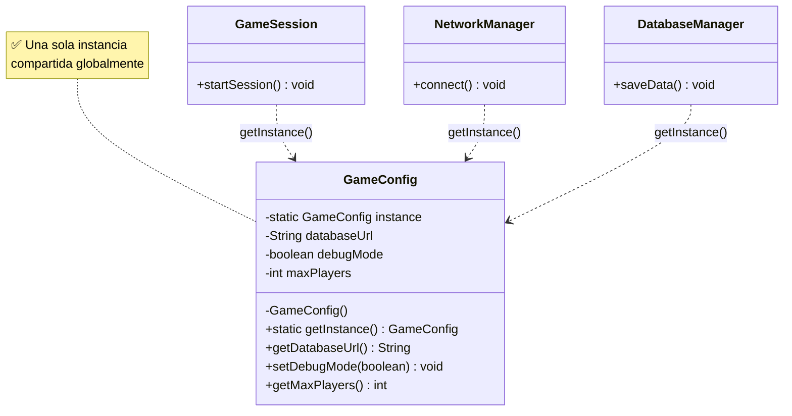

# Laboratorio 03: Patrones Creacionales (Versión Simplificada)

- **Curso**: Ingeniería de Software II
- **Aula**: 851
- **Fecha**: 03/10/2025
- **Jefe de prácticas**: Sebastián Chávarry

---

## Caso de Estudio: Sistema de Juegos Básico

Una empresa desarrolladora necesita un sistema simple para crear juegos y gestionar configuraciones. El sistema debe manejar diferentes tipos de juegos y mantener configuraciones únicas.

---

## Preparación del Proyecto

1. Crea 3 paquetes:
   - `ejercicio01` - Factory Method
   - `ejercicio02` - Abstract Factory
   - `ejercicio03` - Singleton

---

## Ejercicio 1: Factory Method Pattern

### 1) Diagrama del Código Actual (Problemático):

### 2) Diagrama de la Solución (Factory Method):

#### **Implementa la solución creando:**

- `GameFactory` (abstracto) con `createGame()` abstracto y `playGame()` concreto
- `RPGFactory` y `FPSFactory` que extiendan `GameFactory`
- `PuzzleFactory` para demostrar extensibilidad

---

## Ejercicio 2: Abstract Factory Pattern

### 1) Diagrama del Código Actual (Problemático):

### 2) Diagrama de la Solución (Abstract Factory):

#### **Implementa la solución creando:**

- `GameElementFactory` (interface) con métodos de creación
- `PCFactory` y `MobileFactory` que implementen la interface
- Clases específicas: `PCWarrior`, `MobileWarrior`, `PCSword`, `MobileSword`
- Cliente que use una factory sin conocer implementaciones específicas

---

## Ejercicio 3: Singleton Pattern

### 1) Diagrama del Código Actual (Problemático):

### 2) Diagrama de la Solución (Singleton):

#### **Implementa la solución creando:**

- `GameConfig` singleton thread-safe con `getInstance()`
- `NetworkConfig` singleton usando enum
- Modificar los clientes para usar `getInstance()` en lugar de `new`

---

_Enfócate en entender por qué el código inicial es problemático antes de implementar la solución._
